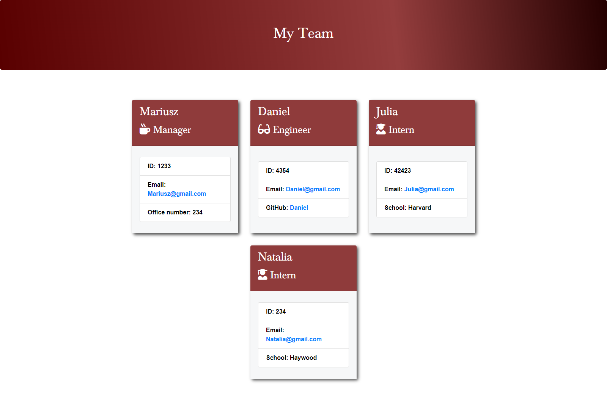

# <p align="center">**My Team Generator**</p>
  ##### <p align="center">*My Team Generator*</p>
  ## Table of Contents
  * [Description](#description)
  * [Usage](#usage)
  * [Languages](#languages)
  * [Installation Instructions](#installation)
  * [Collaboratores](#Contributing)
  * [License](#license)
  * [Contact Me](#Contact-me)
  ## Description
  
 
 ## Usage
  * Create your team in node.js
 
 ## Languages and programs
  * Javascript
  * JQuery
  * node.js

## Installation
To use this application, please install: 
```
npm install inquirer
```
    
## Usage
After cloning the repo and installing the required npm packages, use the command line to navigate to the root of the application and run `node index`.  Follow prompts to add team members to your roster.  Only one manager can be added per team.  Your generated team roster page will be created in the `./dist` folder. 
    

### Screenshots

The application runs from the command line as seen above.

## Tests
To run tests on the application, install
```
npm install jest
```

and run `npm run test` from the command line.
